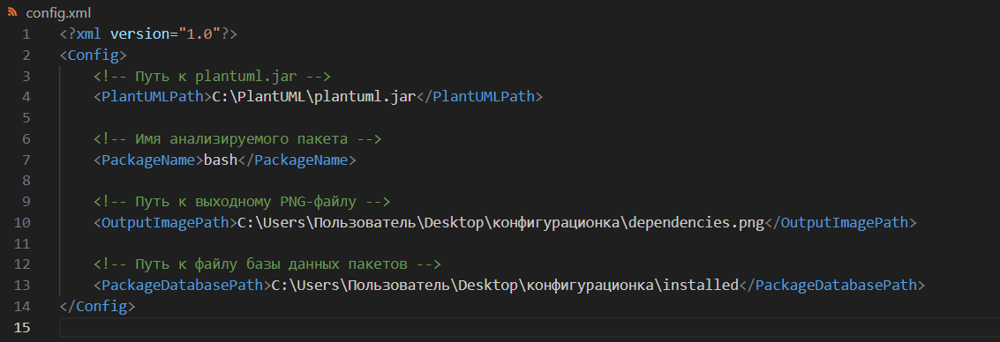

# Visualizer

Второе домашнее задание по Конфигурационному Управлению

## Постановка задачи

### Задание №2
Разработать инструмент командной строки для визуализации графа зависимостей, включая транзитивные зависимости. Сторонние средства для получения зависимостей использовать нельзя. Зависимости определяются по имени пакета ОС Alpine Linux (apk). Для описания графа зависимостей используется представление PlantUML. Визуализатор должен выводить результат в виде сообщения об успешном выполнении и сохранять граф в файле формата png.

Конфигурационный файл имеет формат XML и содержит:
- Путь к программе для визуализации графов.
- Имя анализируемого пакета.
- Путь к файлу с изображением графа зависимостей.
- Путь к базе данных пакетов.

Все функции визуализатора зависимостей должны быть покрыты тестами.

### Запуск программы

Для запуска визуализатора выполните команду:

```bash
python visualizer.py config.xml
```

### Запуск тестов

Для запуска тестов выполните команду:

```bash
python -m unittest test_visualizer.py
```

## Описание алгоритма

1. **Функция `parse_config(config_path: str)`**:
    - Читает конфигурационный файл XML и извлекает пути к PlantUML, имя пакета, путь к выходному изображению и путь к базе данных пакетов.
    - Проверяет наличие всех необходимых полей и существование указанных файлов.

2. **Функция `parse_installed_packages(package_file: str)`**:
    - Парсит файл базы данных установленных пакетов и формирует словарь, где ключ — имя пакета, а значение — список его зависимостей.
    - Обрабатывает строки, начинающиеся с `P:` для пакетов и `D:` для зависимостей.

3. **Функция `build_dependency_graph(package_name: str, packages_db: Dict[str, List[str]])`**:
    - Строит граф зависимостей для заданного пакета, включая транзитивные зависимости, используя рекурсивный обход.

4. **Функция `generate_plantuml(dependency_graph: Dict[str, List[str]])`**:
    - Генерирует код PlantUML на основе построенного графа зависимостей.

5. **Функция `generate_image(plantuml_code: str, plantuml_path: str, output_image_path: str)`**:
    - Создает временный файл с кодом PlantUML.
    - Вызывает PlantUML через `subprocess` для генерации PNG-изображения графа зависимостей.
    - Перемещает сгенерированное изображение в указанное место и удаляет временный файл.

6. **Основная функция `main()`**:
    - Проверяет аргументы командной строки и читает путь к конфигурационному файлу.
    - Вызывает функции для парсинга конфигурации, чтения базы данных пакетов, построения графа зависимостей, генерации PlantUML кода и создания изображения.
    - Выводит сообщение об успешном выполнении или об ошибке.


### Пример тестирования

1. **Вывод программы:**

    

2. **Появившиеся новые файлы:**

    

3. **Вид файла конфигурации:**

    

4. **Вид PNG файла с графиком:**

    

5. **Результаты unittest:**

    


